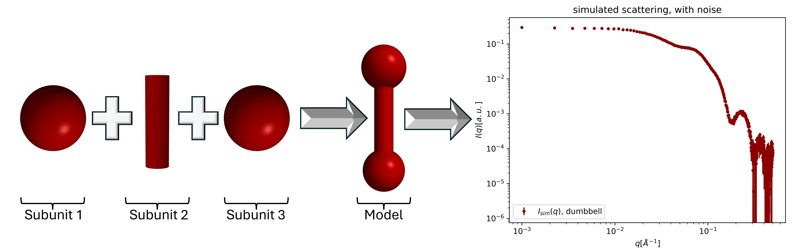
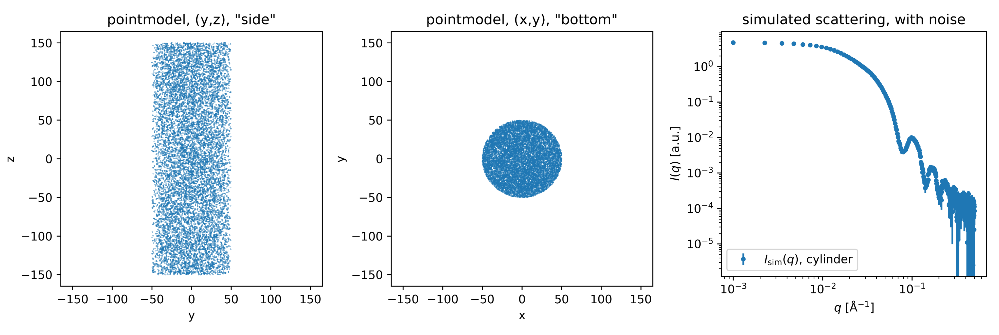
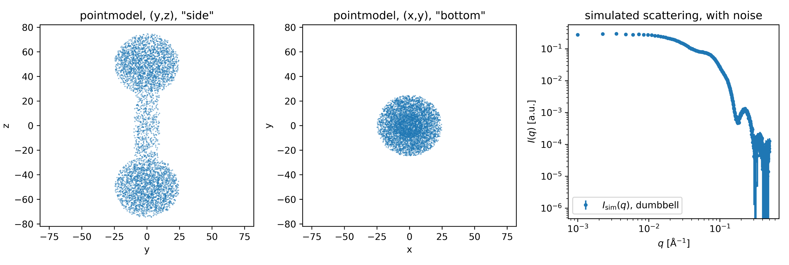
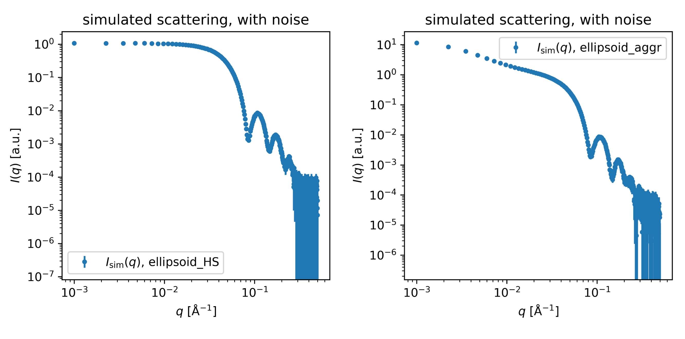
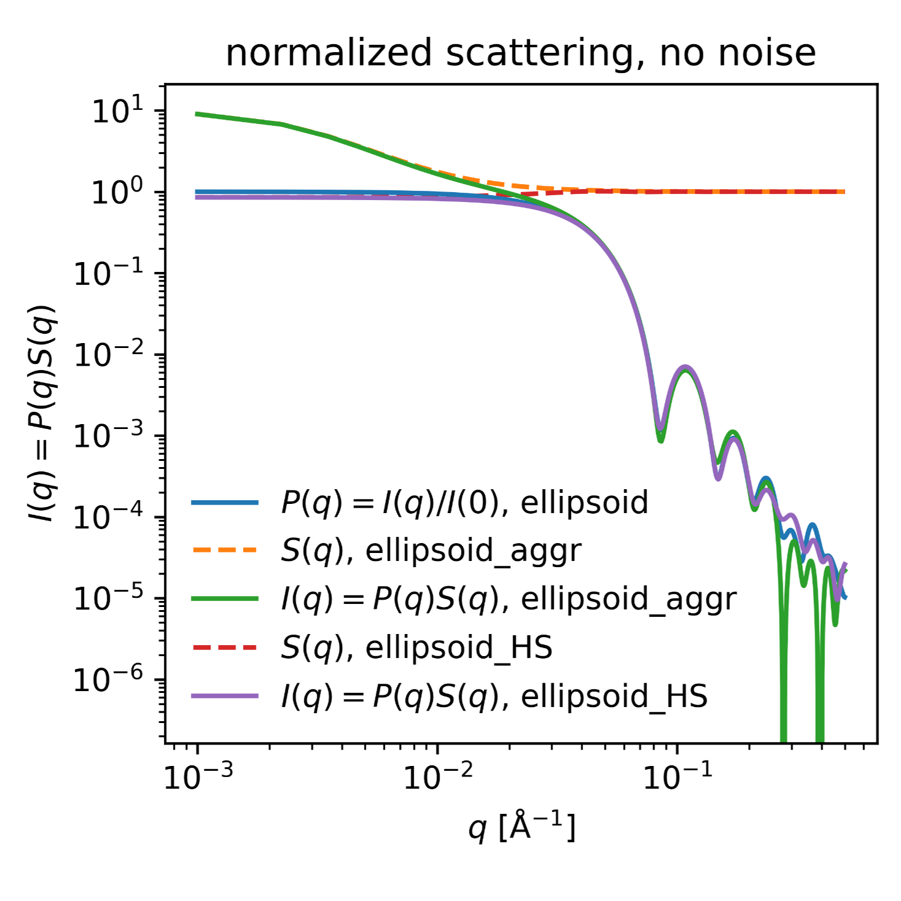
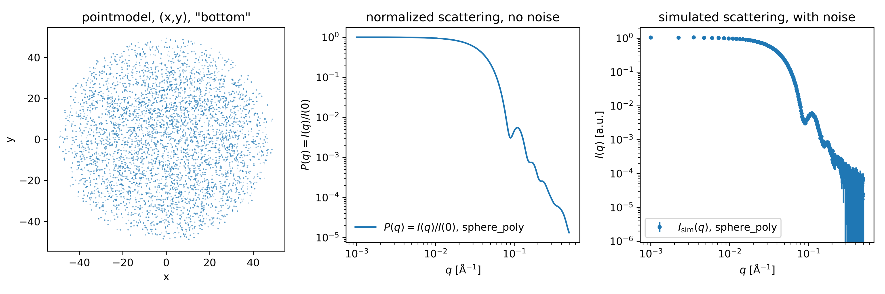
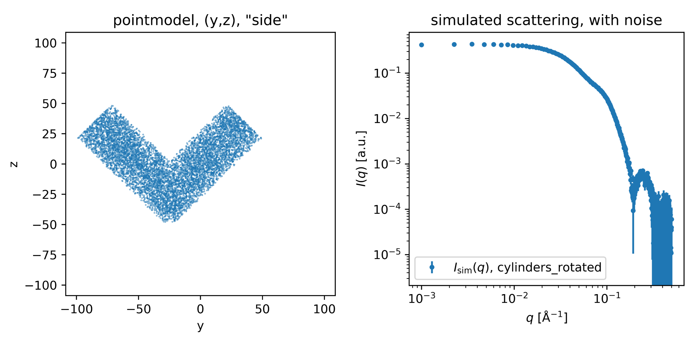

## Shape2SAS

Shape2SAS simulates small-angle x-ray scattering (SAXS) from user-defined models. The models are build from geometrical shapes (subunits), e.g., a dumbbe.l constructed from a cylinder and two tranlated spheres. The model is filled with points and the scattering is calculated by a Debye sum.

<p align="center" id="dumbbell">
  
</p>


## Installation

To install Shape2SAS do the following:

* Install Python3
* Install necessary python packages (see other dependencies) on a local virtual python environment.
* Download the bin folder containing shape2sas.py and helpfunktion.py and cd it. 

#### Other dependencies

All packagees can be downloaded via pip install

* numpy
* matplotlib
* scipy
* fast_histogram

Version numpy==1.26, matplotlib==3.8, scipy==1.12, fast_histogram==0.12 have been used when writing the local batch version, but it is expected that other versions work as well.


## Run Shape2SAS

Open a terminal (Linux) or a command prompt (Windows), and activate your local virtual python environment. Navigate to the directory containing Shape2SAS.py and helperfunktion.py:

```
cd <PATH-TO-DIRECTORY>
```
A model to be simulated in Shape2SAS may now be written from supported inputs (see Shape2SAS inputs). An example of a simple sphere with radius $R = 50$ can be seen below:
```
python shape2sas.py --subunit_type "sphere" --dimension "50"
```
More advanced models can be found in Examples.


## Shape2SAS inputs

Below are tables of flag inputs and supported subunits in Shape2SAS. Shape2SAS has two types of inputs. Model dependent inputs, that only affect the specific model in question, and general dependent inputs that affects all models that are to be build and simulated. 

#### Model dependent inputs:
| Flag          | Type   | Default | Description                                         |
|-----------------|--------|---------|-----------------------------------------------------|
| `--name`       | str  | Model i     | Name of the model  |
| `--dimension`       | list  | Input yourself     | Dimension of subunit (see supported subunits) |
| `--subunit_type`       | str  | Input yourself      | Type of subunits (see supported subunits) |
| `--exclude_overlap`       | bool  | True     | Exclude overlap  |
| `--p`       | float  | 1.0     | Scattering length density  |
| `--com`       | list  | Origin     | Displacement of subunit given as (x,y,z) |
| `--rotation`       | list  | (0,0,0)    | Rotation (in degrees) $R = R_{z}(\gamma)R_y(\beta)R_x(\alpha)$ of subunit given as ($\alpha$,$\beta$,$\gamma$) |
| `--polydispersity`       | float  | 0.0     | Polydispersity of model  |
| `--S`       | str  | None     | Structure factor for model: None/HS/aggregation  |
| `--r_hs`       | float  | 50.0     | Radius of hard sphere  |
| `--frac`       | float  | 0.1     | Fraction of particles in aggregated form per model  |
| `--N_aggr`     | float  | 80      | Number of particles per aggregate per model         |
| `--R_eff`      | float  | 50.0    | Effective radius of aggregates for each model       |
| `--conc`       | float  | 0.02    | Volume fraction concentration                       |
| `--sigma_r`    | float  | 0.0     | Interface roughness for each model                  |            
|        |   |        |   |

#### General inputs:
| Flag          | Type   | Default | Description                                         |
|-----------------|--------|---------|-----------------------------------------------------|
| `--qmin`       | float  | 0.001     | Minimum q-value for the scattering curve  |
| `--qmax`       | float  | 0.5     | Maximum q-value for the scattering curve  |
| `--qpoints`       | int  | 400      | Number of q points  |
| `--exposure`       | float  | 500.0      | Exposure time in arbitrary units  |
| `--prpoints`       | int  | 100      |Number of points in the pair distance distribution function |
| `--Npoints`       | int  | 3000      | Number of simulated points  |
| `--xscale_lin`       | bool  | True       | Include linear q scale (False to include)  |
| `--high_res`       | bool  | False       | Include high plot resolution  |
| `--scale`       | float  | 1.0       | In the plot, scale simulated intensity of each model  |
|        |   |        |   |

<a name="subunit-table" id="table3"></a>
#### Supported subunits in Shape2SAS:
| Name              | Dimensions | Description                                         |
|-------------------------|---------|-----------------------------------------------------|
| `sphere`         | $\texttt{R}$     | Radius $(\texttt{R})$ of the sphere  |
| `hollow_sphere`         |  $\texttt{R, r}$    | Radius $(\texttt{R})$ and inner radius $(\texttt{r})$ of the hollow sphere  |
| `ellipsoid`         |  $\texttt{a, b, c}$    | Axes of tri-axial elllipsoid $(\texttt{a, b, c})$  |
| `elliptical_cylinder`         |  $\texttt{a, b, l}$    | Axes of elliptical cross section $(\texttt{a, b})$ and length $(\texttt{l})$ for a cylinder |
| `cylinder`         |  $\texttt{R, l}$    | Radius $(\texttt{a})$ and length $(\texttt{l})$ for a cylinder |
| `cyl_ring`         |  $\texttt{R, r, l}$    | Radius $(\texttt{R})$, inner radius $(\texttt{r})$ and length $(\texttt{l})$ for a cylinder ring |
| `cuboid`         |  $\texttt{a}$    | Side lengths $(\texttt{a})$ for a cuboid |
| `hollow_cube`         |  $\texttt{a, b}$    | Side lengths $(\texttt{a})$ and inner Side lengths $(\texttt{b})$ for a hollow cube |
| `disc`         |  $\texttt{R, r, l}$    | Outer $(\texttt{R})$ and inner $(\texttt{r})$ radius with length $(\texttt{l})$ for a disc ring |
| `superellipsoid`         |  $\texttt{R, } \textbf{ε} \texttt{, t, s}$    | Equator radius $(\texttt{R})$, eccentricity $(\textbf{ε})$ and shape parameters $(\texttt{t, s})$ for a superellipsoid |
|        |           |   |

## Examples
Generally, the local Shape2SAS version has been built such that the repetition of the same flag from model dependent parameters will start a new model. Therefore, the different subunits associated with single model should all be written after the "--subunit_type" flag as well as their dimensions, displacement, polydispersity and so forth for their respective flag. The order of the subunits written in the "--subunit_type" flag for the model is important, as other parameters that are associated with each subunit in model should follow the same order. Likewise, when giving dimensions to a subunit, this should follow the order specified in table [3](#table3) at the "Dimensions" column. \
When writing more advanced models, it is recommended to write commands in a text file and convert it to a bat file.

### Example 1: Cylinder
A model of a cylinder with radius $R = 50$ and length $l=300$ is simulated with $N_{points}=10000$ number of points and named "cylinder". In commands:

```
python shape2sas.py --subunit_type "cylinder" --dimension "50, 300" --Npoints 10000 --name "cylinder"
```

Figure [1](#example1) shows an illustration of the model and simulated SAXS with noise from the simulation.

<p align="center" id="example1">
  
</p>

*Figure 1: Shape2SAS simulation showing the "side" and "bottom" of the cylinder model and simulated SAXS with noise.*

### Example 2: Dumbbell
A model of a dumbbell with spheres displaced from the origin with $[0, 0, \pm50]$, their radius set to $R = 25$, and a cylinder with $R = 10$ and length $l=100$ are simulated with $N_{points} = 6000$ number of points and named "dumbbell". In commands:
```
python shape2sas.py --subunit_type "sphere, sphere, cylinder" --dimension "25" "25" "10, 100" --com "0, 0, -50" "0, 0, 50" "0, 0, 0" --Npoints 6000 --name "dumbbell"
```

Figure [2](#example2) shows an illustration of the model and simulated SAXS with noise.

<p align="center" id="example2">
  
</p>

*Figure 2: Simulated Shape2SAS output of the simulated model and simulated SAXS with noise.*

### Example 3: Ellipsoid with structure factor
A structure factor is added to a model of an ellipsoid with dimensions $a, \ b, \ c = 50, \ 60, \ 50$. First, a model with hard sphere (HS) structure factor is created with hard sphere radius of $r_{hs} = 60$. Then, a model with aggregation is created with default fraction of particles in aggregated form, with a number of particles per aggregate of $N_{aggr} = 90$ and with a effective radius of aggregates of $R_{eff} = 60$. The number of simuatled points is $N_{points} = 6000$ and the models are named "ellipsoid_HS" and "ellipsoid_aggr". In commands for added HS:

```
python shape2sas.py --subunit_type "ellipsoid" --dimension "50, 60, 50" --S "HS" --r_hs 60 --Npoints 6000 --name "ellipsoid_HS"
```

Using aggregation:

```
python shape2sas.py --subunit_type "ellipsoid" --dimension "50, 60, 50" --S "aggregation" --N_aggr 90 --R_eff 60 --Npoints 6000 --name "ellipsoid_aggr"
```

It should be noted that since the fraction of ellipsoids in aggregated form is default, the flag $\texttt{--frac}$ does not have to be used. Figure [3](#example3) shows the simulated SAXS output with noise for the hard sphere and aggregation case.

<p align="center" id="example3">
  
</p>

*Figure 3: Left: Simulated SAXS for an ellipsoid with noise and a hard sphere structure factor. Right: Simulated SAXS for an ellipsoid with noise and aggregation.*

### Example 4: Creating multiple models
The models from example 3 and an ellipsoid model with no structure factor are plotted together. Each model is simulated with $N_{points} = 6000$ and named. In commands:

```
python shape2sas.py --subunit_type "ellipsoid" --dimension "50, 60, 50" --name "ellipsoid" --subunit_type "ellipsoid" --dimension "50, 60, 50" --S "aggregation" --N_aggr 90 --R_eff 60 --name "ellipsoid_aggr" --subunit_type "ellipsoid" --dimension "50, 60, 50" --S "HS" --r_hs 60 --name "ellipsoid_HS" --Npoints 6000
```
Figure [4](#example4) shows simulated SAXS with noise for all three ellipsoid models plotted together. It should be noted that when creating more models, Shape2SAS will always plot these models together. Other more fitting plots may be made by user from data files that will be outputted for each model created.

<p align="center" id="example4">
  
</p>

*Figure 4: Theoretical SAXS for ellipsoid models with noise and aggregation, HS and no structure factor.*

### Example 5: Sphere with polydispersity
A model of a sphere with radius $R = 50$ has polydispersity of $p = 0.1$ added, is named "sphere_poly" and simulated with $N_{points} = 4000$ points. In commands:

```
python shape2sas.py --subunit_type "sphere" --dimension "50" --polydispersity 0.1 --Npoints 4000 --name "sphere_poly"
```
Figure [5](#example5) shows theoretical and simulated SAXS for the sphere model with added polydispersity.

<p align="center" id="example5">
  
</p>

*Figure 5: Theoretical and simulated SAXS on a sphere model with polydispersity of p = 0.1.*

$\textbf{Example 6: Rotation of two cylinders}$\
A model with two cylinder of $R = 20$ and $l = 100$ are rotated around the x-axis with $\alpha = \pm 45\degree$ with the first cylinder displaced by $[0, -50, 0]$, named "cylinders_rotated" and simulated with $N_{points} = 10000$. In commands:

```
python shape2sas.py --subunit_type "cylinder, cylinder" --dimension "20, 100" "20, 100" --rotation "45, 0, 0" "-45, 0, 0" --com "0, -50, 0" "0, 0, 0" --Npoints 10000 --name "cylinders_rotated"
```

Figure [6](#example6) shows simulated SAXS for the rotated cylinders model. The displacement of the first cylinder is done to create the V-shape like model, since the rotation for each cylinder is done through its center of mass.

<p align="center" id="example6">
  
</p>

*Figure 6: Simulated SAXS for two cylinders rotated around the x-axis with $\alpha \pm 45\degree$.*

## GUI

A GUI of Shape2SAS exists and may be found on [https://somo.chem.utk.edu/shape2sas/](https://somo.chem.utk.edu/shape2sas/)

## Credit

Larsen, A. H., Brookes, E., Pedersen, M. C. & Kirkensgaard, J. J. K. (2023). \
Journal of Applied Crystallography 56, 1287-1294 \
Shape2SAS: a web application to simulate small-angle scattering data and pair distance distributions from user-defined shapes.\
[https://doi.org/10.1107/S1600576723005848](https://doi.org/10.1107/S1600576723005848)

Batch version of Shape2SAS was written by Thomas Bukholt Hansen.
