## Shape2SAS
 *version 2.5*

Shape2SAS simulates small-angle x-ray scattering (SAXS) from user-defined shapes. The models are build from geometrical subunits, e.g., a dumbbell constructed from a cylinder and two translated spheres. The shape is filled with points and the scattering is calculated by a Debye sum.

<p align="center" id="dumbbell">
  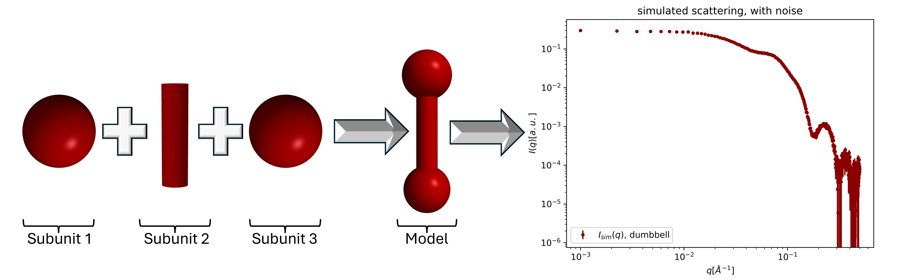
</p>

## Table of Contents
- [Installation](#installation)
  - [Other dependencies](#other-dependencies)
- [Run Shape2SAS](#run-shape2sas)
  - [Available subunits (table)](#subunits)
  - [Output files](#output-files)
- [Examples](#examples)
  - [Example 1: More dimensions - cylinder](#example-1-more-dimensions---cylinder)
  - [Example 2: Multiple subunits - dumbbell](#example-2-multiple-subunits---dumbbell)
  - [Example 3: Structure factors - repulsion and aggregation](#example-3-structure-factors---repulsion-and-aggregation)
    - [Available Structure factors (table)](#structure-factors)
  - [Example 4: Several models](#example-4-several-models)
    - [The compare script (table)](#the-compare-script)
  - [Example 5: Polydispersity](#example-5-polydispersity)
  - [Example 6: Multi-contrast particle - cores-shell](#example-6-multi-contrast-particle---core-shell)
  - [Example 7: Rotation and translation - V-shape](#example-7-rotation-and-translation---V-shape)
    - [Known bug for COM input and solution](#known-bug-for-com-input-and-solution)
  - [Example 8: Number of points - accuracy-vs-runtime](#example-8-number-of-points---accuracy-vs-runtime)
  - [Example 9: Spin-echo SANS - repulsion in real space](#example-9-spin-echo-sans---repulsion-in-real-space)
  - [Example 10: Mixtures - small and large spheres](#example-10-mixtures---small-and-large-spheres)
    - [The mixture script (table)](#the-mixture-script)
- [Shape2SAS inputs](#shape2sas-inputs)
  - [Mandatory inputs](#mandatory-inputs-model-dependent)
  - [Model-dependent inputs](#model-dependent-and-optional-inputs)
  - [General inputs](#general-and-optional-inputs)
  - [Plot-related inputs](#plot-related-and-optional-inputs)
- [GUI](#gui)
- [Credit](#credit)
  - [Contributors](#contributors)
- [Notes](#notes)

## Installation

To install Shape2SAS do the following:

* Install Python3 (you need python3.8 or newer)
* Install necessary python packages (see other dependencies).
* Download the bin folder containing shape2sas.py and helpfunctions.py. 

#### Other dependencies

All python packagees can be downloaded via pip install
* numpy
* matplotlib
* scipy
* fast_histogram
Versions numpy==1.26, matplotlib==3.8, scipy==1.12, and fast_histogram==0.12 have been tested, but other versions may work as well.

[Back to Table of contents](#table-of-contents)

## Run Shape2SAS

Open a terminal (Linux) or a command prompt (Windows). Navigate to the directory containing Shape2SAS.py and helpfunctions.py (should be in the same folder):

```
cd <PATH-TO-DIRECTORY>
```
Shape2SAS requires at least two inputs: --subunit (or -s) and --dimension (or -d). The scattering from a sphere with radius of 50 Å can be simulated with:
```
python shape2sas.py --subunit sphere --dimension 50
open Model_0/plot_Model_0.png Model_0/points_Model_0.png
```
the second line opens the output plot, and the 2D representation of the sphere (Model_0 is the default model name if none is provided).

[Back to Table of contents](#table-of-contents)

### Output files
* `Iq_<model_name>.dat`, `Isim_<model_name>.dat`: theoretical and simulated SAS data
* `pr_<model_name>.dat`: pair distribution
* `Sq_<model_name>.dat`: structure factor (just unity if no structure factor is opted for).
* `plot.png`: plot of p(r), theoretical data and simualated SAS data
* `points_<model_name>.png`: point cloud, 2D projection
* `<model_name>.pdb`: points cloud in 3D, Proten data bank format, can be opened in PyMOL, [Mol* 3D viewer](https://www.rcsb.org/3d-view), etc.
* `sesans.png`: plot of sesans data (if opted for)
* `G_<model_name>.dat`, `G_sim_<model_name>.dat`: theoretical and simulated SESANS data (if opted for)
* `shape2sas.log`: log file, same as the terminal output
  
[Back to Table of contents](#table-of-contents)

### Subunits
The following subunits are currently available: 

| Subunit          | Dimension(s)<sup>*</sup>   |  Alternative names<sup>**</sup>           | Description                |
|------------------|----------------|--------------------------------|----------------------------|
| `sphere` | radius  | `ball`, `sph` | Sphere
| `hollow_sphere` | outer radius, inner radius  | `shell` | Hollow sphere |
| `ellipsoid` | axis1, axis2, axis3  | -- | Tri-axial ellipsoid |
| `cylinder` | radius, length  | `rod`, `cyl` | Cylinder |
| `ring` | outer radius, inner radius, length  | `hollow_cylinder`, `hollow_disc`, `cylinder_ring`, `disc_ring` | Hollow cylinder | 
| `elliptical_cylinder` | radius1, radius2, length  | `elliptical_rod` | Cylinder | 
| `cube` | side length | `dice` | Cube |
| `hollow_cube` | outer side length, inner side length  | -- | Hollow cube (cavity is also a cube) |
| `cuboid` | side length 1, side length 2, side length 3, | `cuboid`, `brick` | cuboid, i.e. not same side lengths |
| `torus` | overall radius, cross-sectional radius  | `toroid`, `doughnut` | Torus, i.e a doughnut shape | 
| `hyperboloid` | smallest radius, curvature, half of the height  | `hourglass`, `cooling_tower`| Hyperboloid, i.e. an filled hourglass shape | 
| `superellipsoid` | equator radius, eccentricity, shape parameter $t$, shape parameter $s$  | --| superellipsoid, very general shape including superspheres and superellipsoids<sup>***</sup> | 

<sup>*</sup> input order is important.   
<sup>**</sup> names are not case-sensitive, and underscores are ignored, so for example Hollowsphere or hollow_sphere or hollowSphere or HoLlo_w_sPh_Ere all give the same subunit.   
<sup>***</sup>[see superellipsoid sasview model](https://marketplace.sasview.org/models/164/)

[Back to Table of contents](#table-of-contents)

## Examples
A list of all options can be found below all the examples.   

### Example 1: More dimensions - cylinder
A model of a cylinder with radius 50 Å and length 300 Å is simulated, and named "cylinder". The name is used in plots and output filenames:
```
python shape2sas.py --subunit cylinder --dimension 50,300 --model_name cylinder
open cylinder/plot_cylinder.png cylinder/points_cylinder.png
```
Dimensions should be given as a list without space, or between quotation marks (then spaces are allowed):
```
python shape2sas.py --subunit cylinder --dimension "50, 300" --model_name cylinder
open cylinder/plot_cylinder.png cylinder/points_cylinder_cylinder.png
```
If quotation marks are used, commas may be omitted from the list: 
```
python shape2sas.py --subunit cylinder --dimension "50 300" --model_name cylinder
open cylinder/plot.png cylinder/points_cylinder.png
```
<p align="center" id="example1">
  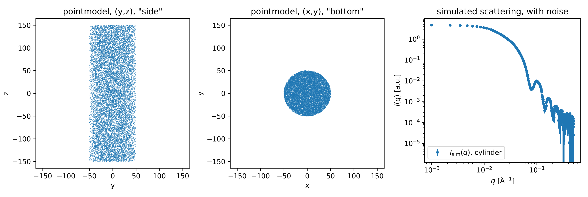
</p>

 *Example 1: Shape2SAS simulation showing the "side" and "bottom" of the cylinder model and simulated SAXS with noise.*

[Back to Table of contents](#table-of-contents)

### Example 2: Multiple subunits - dumbbell
A model can be built of several subunits. For example, a dumbbell can be built by three subunits: two spheres with radius 25 Å displaced from the origin by 50 Å along the z-axiz, and one cylinder with radius of 10 Å and length of 100 Å, aligned along the z axis (default direction):
```
python shape2sas.py --subunit sphere,sphere,cylinder --dimension 25 25 10,100 --com 0,0,-50 0,0,50 0,0,0 --Npoints 6000 --model_name dumbbell
open dumbbell/plot_dumbbell.png dumbbell/points_dumbbell.png
```
If you use quotation marks for input with several values, for example --subunit, then spaces are allowed, also in the name (space is replaced with underscore in file names):  
```
python shape2sas.py --subunit "sphere, sphere, cylinder" --dimension "25" "25" "10, 100" --com "0, 0, -50" "0, 0, 50" "0, 0, 0" --model_name "my dumbbell"
open my_dumbbell/plot_my_dumbbell.png my_dumbbell/points_my_dumbbell.png
```
and, as mentioned in Example 1, you may omit commas if you use quotation marks:
```
python shape2sas.py --subunit "sphere, sphere, cylinder" --dimension 25 25 "10 100" --com "0 0 -50" "0 0 50" "0 0 0" --model_name "my dumbbell"
open my_dumbbell/plot_my_dumbbell.png my_dumbbell/points_my_dumbbell.png
```
<p align="center" id="example2">
  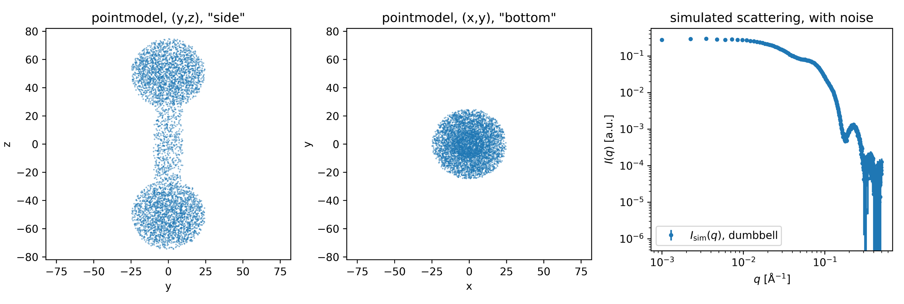
</p>

 *Example 2: Dumbbell model and simulated SAXS data.*

[Back to Table of contents](#table-of-contents)

### Example 3: Structure factors - repulsion and aggregation
Structure factors can be added. This will affect the calculated scattering but not the displayed $p(r)$. 
Below a sample of ellipsoids with semi-axes 50, 60, and 50 Å with hard-sphere repulsion with volume fraction of 0.1 and hard-sphere radius of 60 Å:
```
python shape2sas.py --subunit ellipsoid --dimension 50,60,50 --S HS --S_par 0.1,60 --model_name ellipsoid_HS
open ellipsoid_HS/plot_ellipsoid_HS.png ellipsoid_HS/points_ellipsoid_HS.png
```
Aggregation can also be simulated through a structure factor. Below a sample containing aggregates wirh effective radius of 60, 90 particles per aggregate. A fraction of 10% of the particles are aggregated, the rest are monomeric:
```
python shape2sas.py --subunit ellipsoid --dimension "50, 60, 50" --S aggregation --S_par 60,90,0.1 --model_name ellipsoid_aggr
open ellipsoid_aggr/plot_ellipsoid_aggr.png ellipsoid_aggr/points_ellipsoid_aggr.png
```
<p align="center" id="example3">
  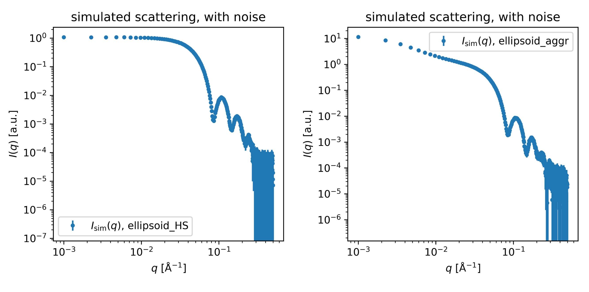
</p>

 *Example 3: Ellipsoids with a hard-sphere structure factor (left) or with aggregation (right).*

[Back to Table of contents](#table-of-contents)

### Structure factors
The following structure factors are implemented

| Structure factor   | Parameters<sup>*</sup>   |  Alternative names<sup>**</sup>           | Description                |
|------------------|----------------|--------------------------------|----------------------------|
| `hardsphere` | volume fraction, hard-sphere radius | `hs` | Hard-sphere structure factor |
| `aggregation` | aggregate effective radius, particles per aggregate, fraction of particles in aggregates | `aggr`, `frac2d` | Two-dimensional fractal aggregate |
| `None` |  | `no`, `unity` | No structure factor (default) |

<sup>*</sup> provided with flag `--S_par` (or `-Sp`) - input order is important.   
<sup>**</sup> names are not case-sensitive, and underscores are ignored, so for example Hollowsphere or hollow_sphere or hollowSphere or HoLlo_w_sPh_Ere all give the same subunit.
 
[Back to Table of contents](#table-of-contents)

### Example 4: Several models
Several models can be compared using the compare script. 

Spheres and cylinders: 
```
python shape2sas.py --subunit sphere --dimension 50 --model_name sphere
python shape2sas.py --subunit cylinder --dimension 20,300 --model_name cylinder
python compare.py --model_names sphere,cylinder --name sph_cyl --plot_points
```
Note that if models are already calculated, you do not need to calculate them again. For example, you could add an ellipsoid to the comparison by
```
python shape2sas.py --subunit ellipsoid --dimension 30,30,100 --model_name ellipsoid
python compare.py --model_names sphere,cylinder,ellipsoid --name sph_cyl_ellips --plot_points
```
Alternatively (legacy, not recommended), comparison can be done in one line:
```
python shape2sas.py --subunit sphere --dimension 50 --model_name sphere --subunit cylinder --dimension 20,300 --model_name cylinder 
open cylinder/plot_cylinder.png sphere/points_sphere.png cylinder/points_cylinder.png
```
Ellipsoids with or without a hard-sphere structure factor:
```
python shape2sas.py -s ellips -d 50,60,50 -m ellipsoid
python shape2sas.py -s ellips -d 50,60,50 -S HS -Sp 0.05,60 -m ellipsoid_HS
python compare.py -m ellipsoid,ellipsoid_HS
```
Increasing sphere size: 
```
python shape2sas.py --subunit sphere --dimension 20 --model_name sph20 
python shape2sas.py --subunit sphere --dimension 50 --model_name sph50 
python shape2sas.py --subunit sphere --dimension 80 --model_name sph80 
python compare.py -m sph20,sph50,sph80
```
<p align="center" id="example4">
  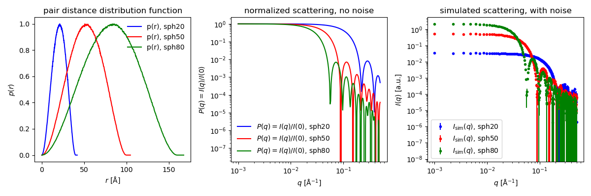
</p>

 *Example 4: Scattering from spheres of increasing size.*

[Back to Table of contents](#table-of-contents)

### The compare script
The `compare.py` script compares results from calculated shape2sas models, using the output files. Inputs are given in the table below, or by typing `python compare.py -h`

for usage, see [Example 4](#example-4-several-models).

| Option             | Short name  |   Arguments               | Description                | Default |
|--------------------|-------------|---------------------------|----------------------------|---------|
| `--model_name` | `-m`        | name of models to compare | modelnames | No default, mandatory input |
| `--name` | `-n`| a name      | prefix of output plot files | model names separated by underscore |
| `--normalization` | `-norm`| max or I0 or none | normalization of p(r) with maximum value or I(0) = sum(pr*dr) or no normalization | max |
| `--sesans` | `-ss`| no argument      | simulate SESANS data | False |
| `--xscale_lin` | `-lin`      | no argument |linear q-scale | False (log scale) |
| `--high_res` | `-hres`       | no argument | high resolution output figures (pdf) | False |
| `--scale`| `-s` | no argument| scale simualated data for better visualization | False |
| `--grid`| `-g`| no argument  | add grid to point distribution | False  |
| `--plot_points` | `-p`| no argument      | plot point cloud 2D projections | False |

##### `compare.py` output files:
`<name>_compare.png`: p(r), theoretical I and simulated I (with noise) for selected models
`<name>_compare_points.png`: 2D projections of the models (if opted for by the `--plot_points' flag)

[Back to Table of contents](#table-of-contents)

### Example 5: Polydispersity
Sphere with radius of 40 Å and relative polydispersity of 20% are here compared to monodisperse spheres with the same radius:
```
python shape2sas.py --subunit sphere --dimension 40 --polydispersity 0.15 --model_name sphere_pd 
python shape2sas.py --subunit sphere --dimension 40 --model_name sphere
python compare.py -m sphere,sphere_pd
```
<p align="center" id="example5">
  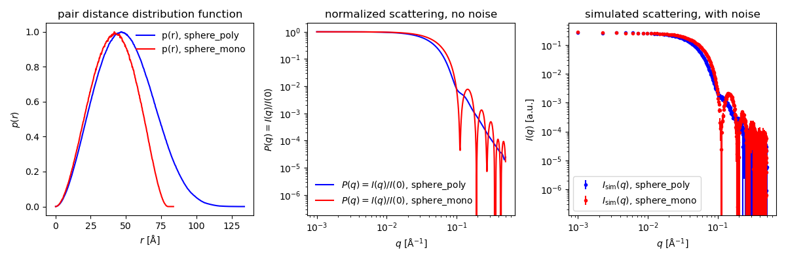
</p>

 *Example 5: Scattering from monodisperse versus polydisperse spheres. Polydispersity is also reflected in the $p(r)$*

[Back to Table of contents](#table-of-contents)

### Example 6: Multi-contrast particle - core-shell
The contrast (excess scattering length density, sld) of each subunit can be adjusted to form multi-contrast particles. For example, a core-shell sphere with core ΔSLD of -1 and shell ΔSLD of 2 may be simulated: 
```
python shape2sas.py --subunit sphere,sphere --dimension 30 45 --sld -1 1 --model_name core_shell
open core_shell/plot_core_shell.png core_shell/points_core_shell.png
```
The small (radius 30-Å) and the large (radius 45 Å) sphere overlap. In that case, the overlapping points of the *latter* model are excluded. So order is important!
The following will just give the scattering of the large sphere, as all points from the smaller sphere are excluded: 
```
python shape2sas.py --subunit sphere,sphere --dimension 45 30 --sld 1 -1 --model_name "not core shell just a sphere"
open not_core_shell_just_a_sphere/plot.png not_core_shell_just_a_sphere/points_not_core_shell_just_a_sphere.png
```
The spherical core-shell model can also be modelled with a sphere for the core and a hollow sphere for the shell. Or, it can be modelled with the two solid spheres by disabling exclusion of overlapping points, but also changing the contrast of the small sphere to -2. The results are the same, but the third method is less effective (accuracy vs number of points).
```
python shape2sas.py --subunit sphere,sphere --dimension 30 45 --sld -1 1 --exclude_overlap True --model_name core_shell_1 
python shape2sas.py --subunit sphere,hollow_sphere --dimension 30 45,30 --sld -1 1 --exclude_overlap True --model_name core_shell_2 
python shape2sas.py --subunit sphere,sphere --dimension 30 45 --sld -2 1 --exclude_overlap False --model_name core_shell_3
python compare.py -m core_shell_1,core_shell_2,core_shell_3 -p
```
<p align="center" id="example6">
  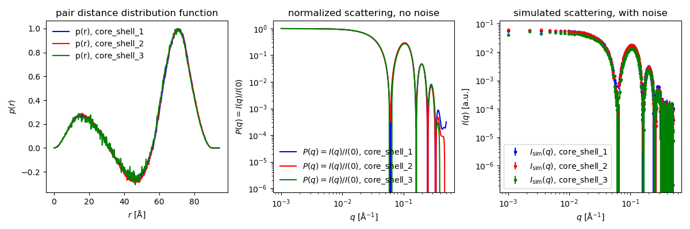
</p>

 *Example 7: Spherical core-shell particles with core ΔSLD of -1 and shell ΔSLD of 1, simulated in three different ways*

[Back to Table of contents](#table-of-contents)

### Example 7: Rotation and translation - V-shape
A model of a "V" is formed with two 100-Å long cylinders with radius of 20 Å, which are rotated 45$\degree$ in each direction around the x-axis. The first cylinder i displaced by 50 Å along the y-axis (com, for centre-of-mass translation). The rotation is also around the center of mass
```
python shape2sas.py --subunit "cylinder, cylinder" --dimension "20, 100" "20, 100" --rotation "45, 0, 0" "-45, 0, 0" --com "0, -50, 0" "0, 0, 0" --model_name cylinders_rotated
open cylinders_rotated/plot_cylinders_rotated.png cylinders_rotated/points_cylinders_rotated.png
```
##### Known bug for COM/Rotation input, and solution/work-around
If the COM translation x-coordinate is negative, you (may) get an error (e.g., `--com "-50, 0, 0" "0, 0, 0"` or `--com "0, 0, 0" "-50, 0, 0"`). This can be circumvented by adding a space before the minus sign (e.g., `--com " -50, 0, 0" "0, 0, 0"`). Quotation marks are needed in this workaround.

<p align="center" id="example6">
  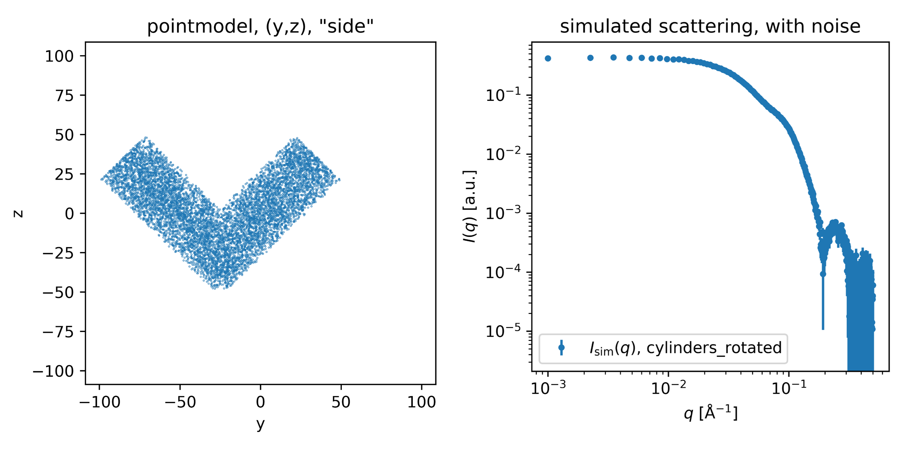
</p>

 *Example 7: Simulated SAXS for two cylinders rotated around the x-axis with $\alpha \pm 45\degree$.*

[Back to Table of contents](#table-of-contents)

### Example 8: Number of points - accuracy vs runtime
The data are simulated using a finite number of points ro represent the structures. Default is 5000 per model. This is a balance between accuracy and speed. As --Npoints is a global parameter, it cannot be selected separately for each model, therefore, three separate runs must be done:
```
python shape2sas.py --subunit ellipsoid --dimension 40,40,60 --model_name ellipsoids500 --Npoints 500
python shape2sas.py --subunit ellipsoid --dimension 40,40,60 --model_name ellipsoids5000 --Npoints 5000
python shape2sas.py --subunit ellipsoid --dimension 40,40,60 --model_name ellipsoids50000 --Npoints 50000
python compare.py --model_names ellipsoids500,ellipsoids5000,ellipsoids50000 --name Npoints
```
Computation time depends on hardware, but increases with the number of points. However, the accuracy also increases, as the number of points increases, and the simulated curve is accurate up to a higher value of q. 
<p align="center" id="example7">
  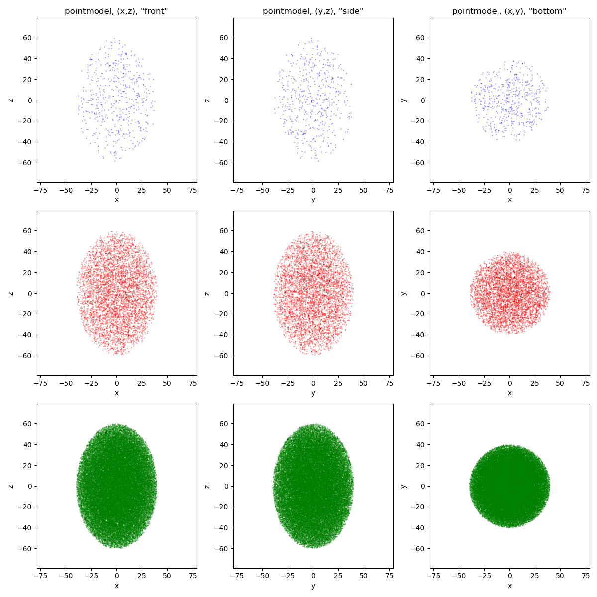
  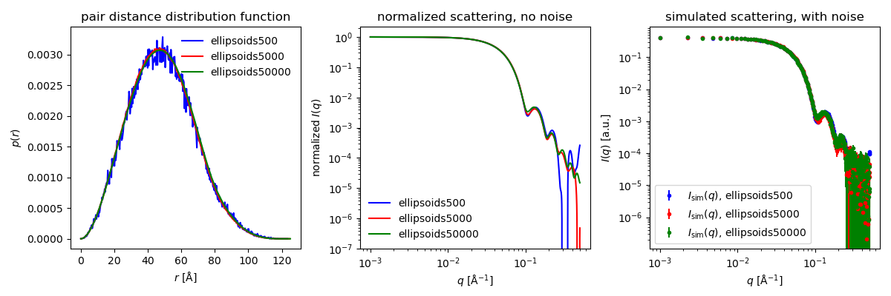
</p>

 *Example 8: Ellipsoids simulated with 500, 5000 or 50,000 points per model*

[Back to Table of contents](#table-of-contents)

### Example 9: Spin-echo SANS - repulsion in real space
Spin-echo SANS (SESANS) is a related technique, and SAS data can be converted to SESANS data by a Henckel transformation. SESANS data is in real space, so easier to interpret - similar to the pair distribution (p(r)) in SAS.

The q-range is extended and sampled with many points to make the tranformation more accurate, therefore, the normal qmin, qmax and qpoints parameters are not used.   

Spheres with or without hard-sphere intearaction in SESANS: 
```
python shape2sas.py --sesans --subunit sphere --dimension 50 --model_name sphere 
python shape2sas.py --sesans --subunit sphere --dimension 50 --S HS --S_par 0.1,60 --model_name sphere_HS
python compare.py -m sphere,sphere_HS --sesans
```
One sphere (radius 250 Å) vs two spheres separated by 1000 Å:
```
python shape2sas.py --sesans --subunit sphere --dimension 250 --model_name sphere 
python shape2sas.py --sesans --subunit sphere,sphere --dimension 250 250 --com 0,-500,0 0,500,0 --model_name two_spheres
python compare.py -m two_spheres,sphere --sesans
```
<p align="center" id="example7">
  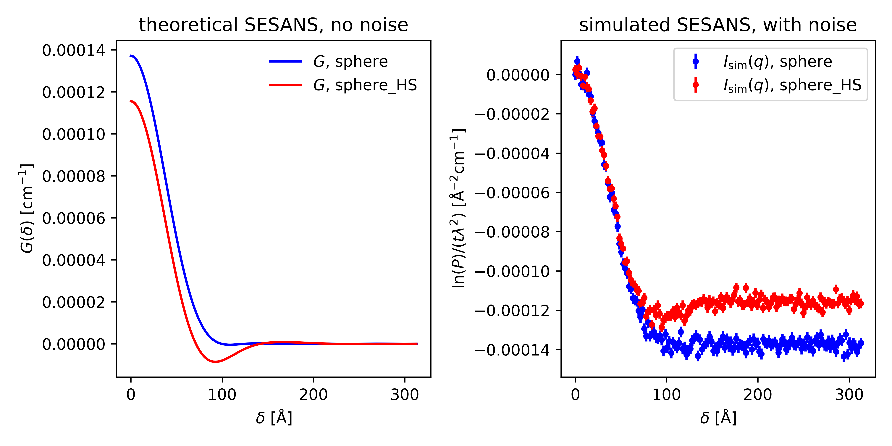
</p>

 *Example 9: SESANS spheres with or without hard-sphere interaction*

[Back to Table of contents](#table-of-contents)

### Example 10: Mixtures - small and large spheres
If you have different particles on solution and the do not interact, you can model this as a mixture. This can be modelled with the mixture script. E.g a sample with non-interacting small and large spheres. The fraction of large is set to 5%:
```
python shape2sas.py -s sph -d 30 -m sph_small
python shape2sas.py -s sph -d 60 -m sph_large
python mixture.py -m sph_small,sph_large -f 95,5
```

[Back to Table of contents](#table-of-contents)

### The mixture script
The `mixture.py` script calculate scattering from a mixture of non-interacting particles, using pre-calculated output files from shape2sas. Inputs are given in the table below, or by typing `python mixture.py -h`

for usage, see [Example 4](#example-4-several-models).

| Option             | Short name  |   Arguments               | Description                | Default |
|--------------------|-------------|---------------------------|----------------------------|---------|
| `--model_name` | `-m`        | model names | names of models to compare | No default, mandatory input |
| `--fraction` | `-f`| fractions | relative fraction of each model | No default, mandatory input |
| `--name` | `-n`| a name      | prefix of output plot files | model names separated by underscore |
| `--normalization` | `-norm`| max or I0 or none | normalization of p(r) with maximum value or I(0) = sum(pr*dr) or no normalization | max |
| `--sesans` | `-ss`| no argument      | include SESANS data | False |
| `--xscale_lin` | `-lin`      | no argument |linear q-scale | False (log scale) |
| `--high_res` | `-hres`       | no argument | high resolution output figures (pdf) | False |
| `--scale`| `-s` | no argument| scale simualated data for better visualization | False |
| `--grid`| `-g`| no argument  | add grid to point distribution | False  |
| `--norm` | `-n`| max, I0 or none  | normalization of p(r) | I0 |

##### `mixture.py`output files:
`mixture_<name>/pr_<name>.dat`, `mixture_<name>/Iq_<name>.dat`, `mixture_<name>/Isim_<name>.dat`: p(r), theoretical I and simulated I (with noise) for mixture of selected models (using `--model_name` optioin), at selected fractions (using the `--fraction`option)   
`mixture_<name>/<name>.png`: plots of the above, campared with the p(r) and scattering from the components. 

[Back to Table of contents](#table-of-contents)

## Shape2SAS inputs
Shape2SAS has two types of inputs: model-dependent inputs, that only affect the specific model in question, and general inputs that affects all models.  

### Mandatory inputs (model-dependent):
| Flag             | Default value | Short name | Description                                         |
|-----------------|---------|-------------------|----------------------------------|
| `--subunit`         | Mandatory, no default      | `-s` | Type of subunits (see [subunit table](#subunits)) |  
| `--dimension`         | Mandatory, no default    | `-d` | Dimensions of subunit (see [subunit table](#subunits)) |

### Model-dependent (and optional) inputs:
| Flag             | Default value | Short name | Description                                         | 
|------------------|---------|-------------|----------------------------------------|
| `--model_name`   | Model 0, Model 1, etc    | `-m` | Name of the model  |  
| `--sld`         | 1.0     | `-sld` | excess cattering length density (or contrast)  | 
| `--polydispersity`         | 0.0 (monodisperse)   | `-pd` | Polydispersity of model  | 
| `--com`         | 0,0,0 (origin)    | `-com` | Displacement of subunit given as (x,y,z) |
| `--rotation`         | 0,0,0  | `-rot`  | Rotation (in degrees) around x,y, or z-axis |
| `--sigma_r`      | 0.0    | `-sigmar` | Interface roughness for each model                  |            
| `--conc`         | 0.02  | `-c`  | Volume fraction (concentration) also affects hard-sphere structure factor |
| `--exclude_overlap`    | False   | `-exclude`  | True (exclude overlap)    | Exclude overlap (True) or not (False) | 
| `--S`         | None   | `-S`  | Structure factor (see [structure factor table](#structure-factors)) |
| `--S_par`         | None  | `-Sp`   | Structure factor parameters (see [structure factor table](#structure-factors)) |

### General (and optional) inputs:
| Flag             | Default | Short name |Description                                         |
|-----------------|---------|------------|-----------------------------------------|
| `--qmin`         | 0.001     | `-qmin` | Minimum q-value (in Å<sup>-1<\sup>) for the scattering curve  |
| `--qmax`         | 0.5     | `-qmax` | Maximum q-value (in Å<sup>-1<\sup) for the scattering curve  |
| `--qpoints`         | 400      | `-Nq` | Number of q points  |
| `--prpoints`         | 100      | `-Np` | Number of points in the pair distance distribution function |
| `--Npoints`         | 5000      | `-N` | Number of simulated points  |
| `--exposure`         | 500      | `-expo` | Exposure time in arbitrary units - higher exposure time decreses simulated noise |

### Plot-related (and optional) inputs:
| Flag             | Default | Short name |Description                                         |
|-----------------|---------|------------|-----------------------------------------|
| `--xscale_lin`         | True       | `-lin` | Linear q scale (default)  |
| `--high_res`         | False       | `-hres` | Use high resoulution in plots (e.g., for publications) |

[Back to Table of contents](#table-of-contents)

## GUI
A GUI of Shape2SAS can be found at [https://somo.chem.utk.edu/shape2sas/](https://somo.chem.utk.edu/shape2sas/) (newest features may not be available at all times). 

[Back to Table of contents](#table-of-contents)

## Credit
If usefull for your work, please cite our paper:

Larsen, A. H., Brookes, E., Pedersen, M. C. & Kirkensgaard, J. J. K. (2023). *Shape2SAS: a web application to simulate small-angle scattering data and pair distance distributions from user-defined shapes*. Journal of Applied Crystallography 56, 1287-1294 \
[https://doi.org/10.1107/S1600576723005848](https://doi.org/10.1107/S1600576723005848)

#### Contributors
* Andreas Haahr Larsen: main developer 
* Thomas Bukholt Hansen: batch script mode, including class structure and documentation
* Lassi Tiihonen: SESANS add-on

[Back to Table of contents](#table-of-contents)

## Notes
Generally, the local Shape2SAS version has been built such that the repetition of the same flag from model dependent parameters will start a new model. Therefore, the different subunits associated with single model should all be written after the "--subunit" flag as well as their dimensions, displacement, polydispersity and so forth for their respective flag. The order of the subunits written in the "--subunit" flag for the model is important, as other parameters that are associated with each subunit in model should follow the same order. Likewise, when giving dimensions to a subunit, this should follow the order specified in the table of subunits.

[Back to Table of contents](#table-of-contents)


