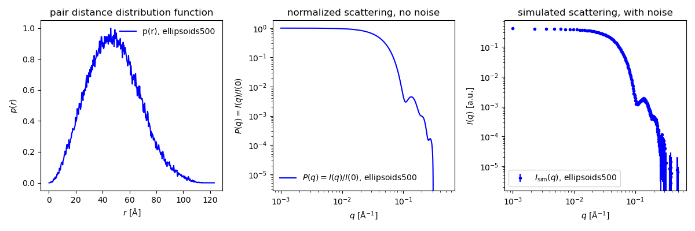
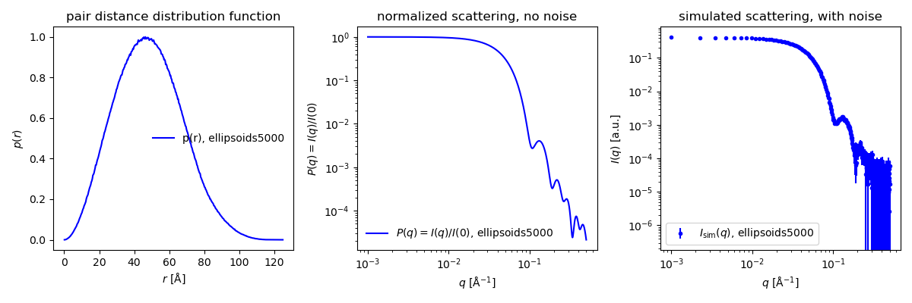
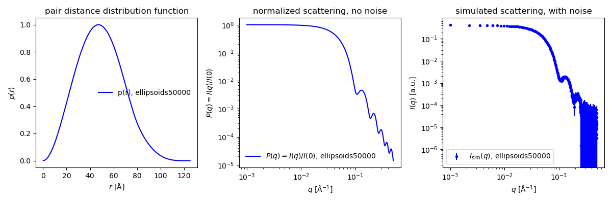

## Shape2SAS
 *version 2.1*

Shape2SAS simulates small-angle x-ray scattering (SAXS) from user-defined shapes. The models are build from geometrical subunits, e.g., a dumbbell constructed from a cylinder and two translated spheres. The shape is filled with points and the scattering is calculated by a Debye sum.

<p align="center" id="dumbbell">
  
</p>


## Installation

To install Shape2SAS do the following:

* Install Python3
* Install necessary python packages (see other dependencies).
* Download the bin folder containing shape2sas.py and helpfunctions.py. 

#### Other dependencies

All python packagees can be downloaded via pip install
* numpy
* matplotlib
* scipy
* fast_histogram
Versions numpy==1.26, matplotlib==3.8, scipy==1.12, and fast_histogram==0.12 have been tested, but other versions may work as well.

## Run Shape2SAS

Open a terminal (Linux) or a command prompt (Windows). Navigate to the directory containing Shape2SAS.py and helpfunctions.py (should be in the same folder):

```
cd <PATH-TO-DIRECTORY>
```
Shape2SAS requires at least two inputs: --subunit_type (or -subtype) and --dimension (or -dim). The scattering from a sphere with radius of 50 Å can be simulated with:
```
python shape2sas.py --subunit_type sphere --dimension 50
open plot.png points_Model1.png
```
the second line opens the output plot, and the 2D representation of the sphere (Model_0 is the default model name if none is provided).

Currently, the following subunits are implemented: 

<a name="subunit-table" id="table3"></a>

| Subunit          | Dimension(s)   |  Alternative names*            | Description                |
|------------------|----------------|--------------------------------|----------------------------|
| `sphere` | radius  | ball | Sphere
| `hollow_sphere` | outer radius, inner radius  | shell | Hollow sphere |
| `ellipsoid` | axis1, axis2, axis3  | -- | Tri-axial ellipsoid |
| `cylinder` | radius,length  | rod | Cylinder |
| `ring` | outer radius, inner radius, length  | hollow_cylinder, hollow_disc, cylinder_ring disc_ring | Hollow cylinder | 
| `elliptical_cylinder` | radius1, radius2, length  | elliptical_rod | Cylinder | 
| `cube` | side length | dice | Cube |
| `hollow_cube` | outer side length, inner side length  | -- | Hollow cube (cavity is also a cube) |
| `cuboid` | side length 1, side length 2, side length 3, | -- | Cuboid, brick |
| `torus` | overall radius, cross-sectional radius  | toroid, doughnut | Torus, i.e a doughnut shape | 
| `hyperboloid` | smallest radius, curvature, half of the height  | hourglass, cooling_tower| Hyperboloid, i.e. an hourglass shape | 
| `superellipsoid` | equator radius, eccentricity, shape parameter $t$, shape parameter $s$  | --| superellipsoid [superellipsoid sasview model](https://marketplace.sasview.org/models/164/) | 

*capitalized names and CamelCase are also recognized: Hollow_sphere, HollowSphere, or hollowsphere.   

## Examples
A list of all options can be found below all the examples.   

### Example 1: Cylinder
A model of a cylinder with radius 50 Å and length 300 Å is simulated, and named "cylinder". The name is used in plots and output filenames:
```
python shape2sas.py --subunit_type cylinder --dimension 50,300 --model_name cylinder
open plot.png points_cylinder.png
```
Dimensions should be given as above (list without space), or between quotation marks (then spaces are allowed):
```
python shape2sas.py --subunit_type cylinder --dimension "50, 300" --model_name cylinder
open plot.png points_cylinder.png
```
<p align="center" id="example1">
  
</p>

 *Example 1: Shape2SAS simulation showing the "side" and "bottom" of the cylinder model and simulated SAXS with noise.*

### Example 2: Multiple subunits in one model
A model can be built of several subunits. For example, a dumbbell can be generated with three subunits: two spheres with radius 25 Å displaced from the origin by $[0, 0, \pm50]$ Å, and one cylinder with radius of 10 Å and length of 100 Å, aligned along the z axis:
```
python shape2sas.py --subunit_type sphere,sphere,cylinder --dimension 25 25 10,100 --com 0,0,-50 0,0,50 0,0,0 --Npoints 6000 --model_name dumbbell
open plot.png points_dumbbell.png
```
If you use quotation marks for input with several values, for example --subunit_type, then spaces are allowed, also in the name (space is replaced with underscore in file names):  
```
python shape2sas.py --subunit_type "sphere, sphere, cylinder" --dimension "25" "25" "10, 100" --com "0, 0, -50" "0, 0, 50" "0, 0, 0" --model_name "my dumbbell"
open plot.png points_my_dumbbell.png
```
and you may also omit commas if you use quotation marks.
```
python shape2sas.py --subunit_type "sphere, sphere, cylinder" --dimension 25 25 "10 100" --com "0 0 -50" "0 0 50" "0 0 0" --model_name "my dumbbell"
open plot.png points_my_dumbbell.png
```

<p align="center" id="example2">
  
</p>

 *Example 2: Dumbbell model and simulated SAXS data.*

### Example 3: Structure factors
Structure factors can be added. This will affect the calculated scattering but not the displayed $p(r)$. 
Below a sample of ellipsoids (axes $a, \ b, \ c = 50, \ 60, \ 50$) with hard-sphere repulsion ($r_{hs} = 60$) is simulated:
```
python shape2sas.py --subunit_type ellipsoid --dimension "50, 60, 50" --S HS --r_hs 60 --model_name ellipsoid_HS
open plot.png points_ellipsoid_HS.png
```
Aggregation can also be simulated, below a sample with 10% of the particles (ellipsoids) being aggregated. There are 90 particles per aggregate (N_aggr) and the simulated aggregates have an effective radius (R_eff) of 60 Å:
```
python shape2sas.py --subunit_type ellipsoid --dimension "50, 60, 50" --S aggregation --N_aggr 90 --R_eff 60 --frac 0.1 --model_name ellipsoid_aggr
open plot.png points_ellipsoid_aggr.png
```
<p align="center" id="example3">
  
</p>

 *Example 3: Ellipsoids with a hard-sphere structure factor (left) or with aggregation (right).*

#### Available structure factors

| Structure factor          | Options  |  Alternative names<sup>*<\sub>           | Description                |
|------------------|----------------|--------------------------------|----------------------------|
| `hardsphere` |  | hs, hard-sphere | Hard-sphere structure factor with hard-sphere radius (--r_hs) and volume fraction (--conc)
| -- | --r_hs | -rhs | hard-sphere radius
| -- | --conc | -conc | volume fraction
| `aggregation` | | aggr, frac2d | Two-dimensional fractal aggregate
| -- | --N_aggr   | -Naggr | number of particles per aggregate
| -- | --R_eff  | -Reff-- | Effective radius of aggregate
| -- | --frac  | -frac | fraction of particles in aggregate
| `None` |  | no 0 1 unity | No structure factor (default)

 <sup>*<\sub>capitalized versions and CamelCase are also recognized: Hollow_sphere, HollowSphere, or hollowsphere.  

### Example 4: Several models
Several models can be created simultaneously. They are made individually, but plotted together in plot.png, for easy comparison. 

Spheres and cylinders: 
```
python shape2sas.py --subunit_type sphere --dimension 50 --model_name sphere --subunit_type cylinder --dimension 20,300 --model_name cylinder 
open plot.png points_sphere.png points_cylinder.png
```
Ellipsoids with or without a hard-sphere structure factor:
```
python shape2sas.py --subunit_type ellipsoid --dimension 50,60,50 --S None --model_name ellipsoid --subunit_type ellipsoid --dimension 50,60,50 --S HS --r_hs 60 --conc 0.05 --model_name ellipsoid_HS
open plot.png points_ellipsoid.png points_ellipsoid_HS.png
```
Increasing sphere size: 
```
python shape2sas.py --subunit_type sphere --dimension 20 --model_name sph20 --subunit_type sphere --dimension 50 --model_name sph50 --subunit_type sphere --dimension 80 --model_name sph80 
open plot.png points_sph20.png points_sph50.png points_sph80.png
```
<p align="center" id="example4">
  
</p>

 *Example 4: Scattering from spheres of increasing size.*

### Example 5: Polydispersity
Sphere with radius $R = 40$ and relative polydispersity of $p = 0.2$ (and compared to monodisperse spheres):
```
python shape2sas.py --subunit_type sphere --dimension 40 --polydispersity 0.2 --model_name sphere_poly --subunit_type sphere --dimension 40 --model_name sphere_mono
open plot.png points_sphere_poly.png points_sphere_mono.png
```
<p align="center" id="example5">
  
</p>

  *Example 5: Scattering from monodisperse versus polydisperse spheres. Polydispersity is also reflected i the $p(r)$*

### Example 6: Rotation 
A model with two cylinder of $R = 20$ and $l = 100$ are rotated around the x-axis with $\alpha = \pm 45\degree$ with the first cylinder displaced by $[0, -50, 0]$:
```
python shape2sas.py --subunit_type "cylinder, cylinder" --dimension "20, 100" "20, 100" --rotation "45, 0, 0" "-45, 0, 0" --com "0, -50, 0" "0, 0, 0" --model_name cylinders_rotated
open plot.png points_cylinders_rotated
```
The rotation is done around the center of mass.
<p align="center" id="example6">
  
</p>

 *Example 6: Simulated SAXS for two cylinders rotated around the x-axis with $\alpha \pm 45\degree$.*

### Example 7: Number of points
The data are simulated using a finite number of points ro represent the structures. Default is 5000 per model. This is a balance between accuracy and speed.  
```
python shape2sas.py --subunit_type ellipsoid --dimension 40,40,60 --model_name ellipsoids500 --Npoints 500
open plot.png points_ellipsoids500.png
```
```
python shape2sas.py --subunit_type ellipsoid --dimension 40,40,60 --model_name ellipsoids5000 --Npoints 5000
open plot.png points_ellipsoids5000.png
```
```
python shape2sas.py --subunit_type ellipsoid --dimension 40,40,60 --model_name ellipsoids50000 --Npoints 50000
open plot.png points_ellipsoids50000.png
```

<p align="center" id="example7">
  
  
  
</p>

 *Example 7: Ellipsoids simulated with 500, 5000 or 50,000 points*

## Shape2SAS inputs
Below are tables of flag inputs in Shape2SAS. Shape2SAS has two types of inputs: model-dependent inputs, that only affect the specific model in question, and general dependent inputs that affects all models.  

#### Model-dependent inputs:
| Flag          | Type   | Default | Description                                         |
|-----------------|--------|---------|-----------------------------------------------------|
| `--model_name` | str  | Model i     | Name of the model  |
| `--dimension`       | list  | Input yourself     | Dimension of subunit (see supported subunits) |
| `--subunit_type`       | str  | Input yourself      | Type of subunits (see supported subunits) |
| `--exclude_overlap`       | bool  | True     | Exclude overlap  |
| `--p`       | float  | 1.0     | Scattering length density  |
| `--com`       | list  | Origin     | Displacement of subunit given as (x,y,z) |
| `--rotation`       | list  | (0,0,0)    | Rotation (in degrees) $R = R_{z}(\gamma)R_y(\beta)R_x(\alpha)$ of subunit given as ($\alpha$,$\beta$,$\gamma$) |
| `--polydispersity`       | float  | 0.0     | Polydispersity of model  |
| `--S`       | str  | None     | Structure factor for model: None/HS/aggregation  |
| `--r_hs`       | float  | 50.0     | Radius of hard sphere  |
| `--frac`       | float  | 0.1     | Fraction of particles in aggregated form per model  |
| `--N_aggr`     | float  | 80      | Number of particles per aggregate per model         |
| `--R_eff`      | float  | 50.0    | Effective radius of aggregates for each model       |
| `--conc`       | float  | 0.02    | Volume fraction (concentration) also used in hard-sphere structure factor                       |
| `--sigma_r`    | float  | 0.0     | Interface roughness for each model                  |            

#### General inputs:
| Flag          | Type   | Default | Short name |Description                                         |
|-----------------|--------|---------|------------|-----------------------------------------|
| `--qmin`       | float  | 0.001     | -qmin | Minimum q-value for the scattering curve  |
| `--qmax`       | float  | 0.5     | -qmax | Maximum q-value for the scattering curve  |
| `--qpoints`       | int  | 400      | -Nq | Number of q points  |
| `--exposure`       | float  | 500.0      | -expo | Exposure time in arbitrary units  |
| `--prpoints`       | int  | 100      | -Np | Number of points in the pair distance distribution function |
| `--Nqpoints`       | int  | 400      | -Nq | Number of q-values in simulated data  |
| `--Npoints`       | int  | 3000      | -N | Number of simulated points  |
| `--xscale_lin`       | bool  | True       | -lin | Linear q scale (default)  |
| `--high_res`       | bool  | False       | -hres | Include high plot resolution  |
| `--scale`       | float  | 1.0       | -scale | In the plot, scale simulated intensity of each model  |

## GUI

A GUI of Shape2SAS exists may be found on [https://somo.chem.utk.edu/shape2sas/](https://somo.chem.utk.edu/shape2sas/). 

## Credit

Larsen, A. H., Brookes, E., Pedersen, M. C. & Kirkensgaard, J. J. K. (2023). \
Journal of Applied Crystallography 56, 1287-1294 \
Shape2SAS: a web application to simulate small-angle scattering data and pair distance distributions from user-defined shapes.\
[https://doi.org/10.1107/S1600576723005848](https://doi.org/10.1107/S1600576723005848)

Batch version of Shape2SAS was written by Thomas Bukholt Hansen.
Updated and maintained by Andreas Haahr Larsen. 

## Notes
Generally, the local Shape2SAS version has been built such that the repetition of the same flag from model dependent parameters will start a new model. Therefore, the different subunits associated with single model should all be written after the "--subunit_type" flag as well as their dimensions, displacement, polydispersity and so forth for their respective flag. The order of the subunits written in the "--subunit_type" flag for the model is important, as other parameters that are associated with each subunit in model should follow the same order. Likewise, when giving dimensions to a subunit, this should follow the order specified in the table of subunits.

